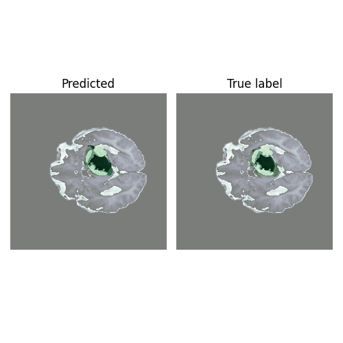
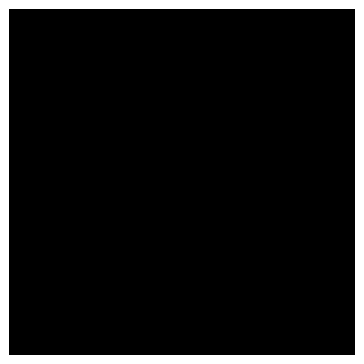

# Brain Tumor Segmentation
## Intro  
This repository contains implementation of the 3D-UResNet[1] model and was trained on MICCAI BRaTS dataset from Kaggle[2] that combines MRI images from 2020, 2019, and 2018 competitions. In contrast to UNet, UResNet, as the name suggests, employs residual blocks instead of concatenation to enable unhindered learning and use more layers.

## MRI Image and the segmented image  
### Original and Segmented Image
In the following image, the green color pixels represents the tumorous cells.  

### Original Image  

### Segmented Image  

## References  
1. U-ResNet: Ultimate coupling of Registration and Segmentation with deep Nets https://link.springer.com/chapter/10.1007/978-3-030-32248-9_35
2. BRaTS: Brain Tumor Segmentation https://www.kaggle.com/datasets/andrewmvd/brain-tumor-segmentation-in-mri-brats-2015
